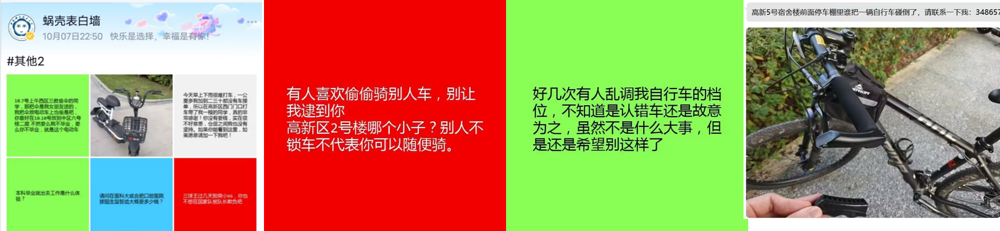
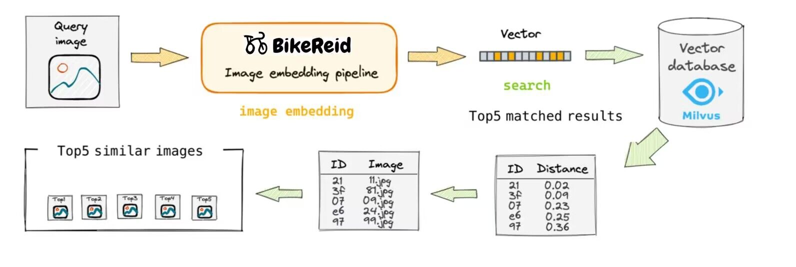

# 结题报告

## 需求分析

### 开发背景
随着社会的发展，公共安全成为全社会的一个共同话题，与之相辅相成的视频监控系统也得到了大量的普及。视频监控系统可以直观的再现目标场景，可作为公安侦破案件的强力辅助。在执法部门的工作中，目标的识别和定位是及其关键的一步，然而现有的监控部署下，这个关键步骤几乎是靠着人力完成的。在这个讲究数据和效率的时代，通过人工观察监控录像查找结果显然存在着很大的资源浪费以及效率的低下。另外，由于摄像头的分辨率等硬件缺陷，很难得到清晰的人身图像，因此，已经大力推广的基于特征点的人脸识别技术已不再适用此场景。由于传统人工查询的不便性以及人脸识别的无法应用，我们的自行车防盗重识别的项目也应随之展开。

我们采用了YOLO (You Only Look Once)[^yolo]算法用于目标识别，并使用ReID算法（基于FastReID框架[^fast_reid]）进行自行车识别，创建了一个找回系统。系统中，服务器在监控端实时监测并获取自行车身份与位置，并且在用户端提供查询接口，用户输入自己自行车的图片就可找到其最近的出现位置。

在系统的初始学习阶段，我们利用真实校园监控资料中提取到的自行车及骑手图像[^bike_dataset]来训练深度学习模型，使其能够辨别自行车身份。若学生发现自己的自行车不翼而飞，他们可以直接在系统上上传自己自行车的照片。系统会立即返回历史捕捉到该自行车的出现地点及监控图像，这不仅帮助车主迅速了解自行车的最后出现位置，还可以获取疑似盗窃者的图像，大大加速了寻找自行车的过程。

### 市场分析

#### 目标用户

我们的项目针对的目标用户主要是大学校园内的学生和教职员工，他们每天都依赖自行车作为主要的出行工具。由于繁忙的学业和工作，这些用户需要一个简便且高效的方式来保障他们的自行车安全。特别是在面对日益增长的自行车盗窃事件时，他们希望能在车辆失窃后，迅速定位到疑似盗窃者和自行车的最后出现位置，从而增加寻回失窃自行车的可能性，减小所需的时间成本。

#### 竞品分析

在当前市场上，针对自行车盗窃问题，已有一些基于物理锁和GPS跟踪器组合的解决方案，旨在提供自行车的实时位置跟踪。但这些方案在校园内普及和推广上面临一定挑战。首先，它们往往需要用户购买和安装额外的硬件设备，这无疑增加了学生的经济负担，并难以推行。其次，由于校园内环境相对封闭、频繁的自行车停放变动，使得这些方案的效果并不稳定。相比之下，我们的系统利用了校园现有的监控设备，在不侵犯隐私的条件下，能够实时跟踪自行车的位置，无需用户额外投资或安装，为校园内的自行车安全提供了一个更为全面和便捷的解决方案，具有显著的竞争优势。


## 项目设计

首先我们基于yolox目标检测算法，以监控画面的画面帧作为输入，来实时识别-分割-追踪校园中正在骑行的自行车与自行车上的人。

综合考量了监控分辨度低人像模糊,自行车特征信息不易提取、多机位拍摄带来的画面追踪困难等问题，我们训练了自己的人车重识别的工业级AI模型BikeReid，分离人车特征向量进行表征和度量学习，根据人的穿着、姿态与自行车纹理等特征完成识别分类任务，避免了传统的人脸识别方案带来的隐私问题。每帧的Reid计算生成特征向量平均仅需0.024s,完美完成了实时性的要求。BikeReid在rank10准确率上达到了79.53%,达到工业上部署要求。


此外，我们建立一个Mysql数据库，用来存储各自行车与人的的配对、监控位置与时间戳等基本信息；而对于核心的查询预警功能，利用Milvus引擎针对海量的特征向量进行高速相似度查询。当发现全新的配对时，会将此配对及对应画面加入预警库，从而对自行车盗窃进行预警，并为找回被盗自行车提供便利。


我们的预期使用场景是:当有学生自行车被盗时，数据库会自动发出预警信息，校方仅需查询一次即可获知所有疑似人车不匹配画面帧，选中后再次点击查询，即可显示此辆自行车在监控记录里所有历史人车配对图片,大幅减少查看监控的代价，从而提高寻找被盗自行车的效率。

本项目扩展性良好，对于特征信息更突出的电瓶车、摩托车、乃至汽车等交通工具，只重训REID模型即可实现相同的功能，这里以难度系数较高的自行车识别作为演示。


## 项目框架

项目主要分为人车跨镜头重识别管线与数据库交互管线两部分。


### 人车跨镜头重识别管线
下图充分展现了我们的人车跨镜头重识别管线工作的困难之处：不仅需要跨摄像头识别，还需要在低分辨率、多人、多车等复杂情况下进行识别。

为了解决这些问题，我们的人车跨镜头重识别管线主要分为以下几个步骤：
- 输入端为学校内各监控的画面
- 使用YOLOx目标检测模型，分割出画面中的自行车与人，分别框出人与车的位置坐标，并给出锚框置信度。。
- 将得到的人与车图像，分送入Reid模型进行跨摄像头追踪匹配，得到人与自行车的特征向量embedding。


### 数据库交互管线


我们使用一个数据库来存储各自行车与人的特征向量的配对。
同时我们也建立一个预警库来存储可疑的人车配对及其画面样本。当发现全新的记录时，会将此配对及对应画面加入预警库以便对自行车盗窃进行预警，存储的画面将用于为找回被盗自行车提供便利。


- 数据库运行初期需要一定时间收集数据来建库。每年新生入学时也需要暂停预警功能，以便将新生数据入库。
- 考虑到新购买自行车等产生新的人车配对的情况，可以将预警库中较长时间跨度内多次出现的自行车配对加入正常数据库，不进行预警。
- 数据库中许久未访问的项可视为错误识别结果或毕业学生数据，用老化机制来剔除。
- 共享单车的数据可以被过滤。


## 模块设计

### 目标检测模块

yolo算法设计快速、准确且易于使用，使其成为各种物体检测与跟踪、实例分割、图像分类和姿态估计任务的绝佳选择 ，具有突出的实时性和高精度等优良特性。 


目标检测模块使用YOLOx目标检测算法，对输入的画面进行目标检测，分割出画面中的自行车与人。

我们选择YOLOX-m模型来完成目标检测功能，该模型参数量为25.33M, Gflops量为73.98，在V100显卡上YOLOX对一帧图像耗时平均为0.024s（图像大小不影响结果，因为其大小会被标准化）

功能：

- 对输入画面进行目标检测
- 分割出自行车与人的目标
- 输出分割结果及位置信息


### 重识别模块

针对监控画质难题，仅仅利用现有的yolo模型无法胜任此任务。故训练了自己的BikeReid模型是重中之重。

训练的AI模型负责将分割出的人车图像分别送入模型进行跨摄像头重识别，得到自行车的特征向量，是本项目核心所在。
下面是BikeReid模型与其余几个模型的效果对比图：

功能：

- 接收分割出的人车图像
- 进行重识别任务(Re-identification)
- 提取自行车的特征向量并输出


### 数据库模块

数据库模块通过MYSQL和Milvus两个数据库耦合共同实现。简要来说，其中MySQL记录人、车、监控编号、时间戳等基本信息，建立关系型数据库；而Milvus向量数据库则专用于自行车特征向量的存储，高速检索，相似度查询功能。


**MySQL部分：**

主功能分为两大块：

1. 新增数据插入：首先进行老化机制判定，剔除过时数据；随后将数据里的自行车特征向量，送入milvus进行相似度检索查询自行车id。若从未出现此id，则插入；若已有记录，则更新该监控编号下的时间戳，保存相关图片信息
2. 用户查询与删除：对于用户提供的需查询自行车图片，返回top-k个相似度的自行车图片以供参考，进一步显示该辆车的所有历史匹配帧，实现被盗自行车的追回。对于用户授权的车主更换，删除原车主在数据库里的记录，以免触发误预警。

##### MySQL存储字段示例：

-  id ：主键
-  bicycle_id ：自动生成的每辆自行车的唯一标识符，创建index
-  camera_id ：监控摄像头编号
-  start_time ：该监控机位下某人车对首次出现帧时间戳
-  end_time ：该监控机位下某人车对最后出现帧时间戳
-  location_desc ：地点信息描述
-  img_path ：画面帧存放路径，供后续查询


**Milvus部分：**

 Milvus是 基于 FAISS、Annoy、HNSW 的向量搜索数据库，核心是解决稠密向量相似度检索的问题。此外，Milvus 支持数据分区分片、数据持久化、增量数据摄取、标量向量混合查询、time travel 等功能， 针对万亿级向量完成毫秒级搜索，适配在本项目特征向量embedding的索引检索任务 。 

此部分主要功能有

1. 根据索引进行相似度检索:返回记录里余弦相似度top-k个结果
2. 自行车embedding插入：先在milvus里面检索top1,如果与top1的相似度大于阈值，就不插入，否则插入


##### milvus存储字段：

- bicycle_id ：主键，与MySQL表中bicycle_id 字段相同，类似于外键关联两个表
- bicycle_embedding ：某辆自行车通过reid管线生成的2048维特征向量。

## 测试与改进

### 性能测试结果
#### GPU环境
测试环境：
- 显卡：V100（16GB显存）
- CPU：Intel(R) Xeon(R) Gold 6148 CPU（12核）

YOLOX对一帧图像耗时平均为0.024s（图像大小不影响结果，因为其大小会被标准化）
Re-ID模型获取一个对象的embedding耗时0.024s（图像大小不影响结果，因为其大小会被标准化）

可以看到，在V100显卡的加持之下，模型对监控画面的识别速度可以达到每秒10-20帧（视监控中的自行车数量而定），具有很好的实时性；由于画面中自行车出现时间通常在数秒以上，因此对识别的帧率要求不高，由此也可将系统并发地用于多个摄像头的识别检测。

#### CPU环境
测试环境：
- AMD Ryzen 7 4800H with Radeon Graphics 2.90 GHz (16核)

YOLOX对一帧图像耗时平均为0.5-0.6s（图像大小不影响结果，因为其大小会被标准化）
Re-ID模型获取一个对象的embedding耗时0.5-0.6s（图像大小不影响结果，因为其大小会被标准化）

可以看到，即使在CPU环境下，对监控画面的识别帧率也可达到每秒1帧，符合该场景下不高的帧率要求，由此即使是无显卡配置或较低配置的显卡也能满足我们的要求。

### Re-ID模型评估结果

模型在BikePerson数据集[^bike_dataset]上的一半自行车数据（1670辆自行车，33382张图片）进行训练，并在另一半自行车数据（1652辆自行车，33032张图片）上进行测试。测试集中的每辆自行车都不在训练集中。
测试集中每辆自行车在其中一个摄像头下的图片作为query集，其余摄像头下的图片作为gallery集。我们的模型在测试集上的表现如下：

| Dataset    | Rank-1 | Rank-5 | Rank-10 | mAP   | mINP  | metric |
| ---------- | ------ | ------ | ------- | ----- | ----- | ------ |
| BikePerson | 56.25  | 71.43  | 79.53   | 52.79 | 34.39 | 54.52  |

可以看到，用户在查询时有56.25%的概率可以在返回的第一张图片中找到自己查询的自行车，有79.53%的概率可以在返回的前10张图片中找到自己的自行车，这样的精度符合我们的项目需求。


### 风险管理计划

#### 关于识别精度的风险及其对策

在自行车识别中，工作环境的严苛性要求在高噪音、低分辨率、少量特征点以及多样化的拍摄角度下实现准确的车辆识别。尽管车辆图像可以通过YOLO技术分割，从而有效降低背景的干扰，但为确保准确度，我们需要采纳高精度的表示学习方法以区分自行车的身份。而对于人脸的部分，可以直接使用现有的库进行识别。

需要注意的是，识别结果可能不稳定，同一辆车在相近的时间和地点下的识别结果可能会产生波动。为了增加稳定性和鲁棒性，我们可能需要引入基于时间和地点信息的滤波算法，确保在时间和地点的小范围变动内，识别结果保持连贯。

**提高识别精度的策略如下：**

-   **改进表示学习方法**：研究并采用更高精度的表示学习方法，例如采用更深、更复杂的神经网络结构。同时，考虑利用预训练模型和迁移学习，从大规模数据集中提取有价值的先验知识。

-   **数据增强技术**：利用旋转、平移、缩放等数据增强方法，扩充和丰富自行车图像数据，以增强模型的泛化能力。

-   **设置合理阈值**：在目标检测环节，适当设置置信度阈值和非极大值抑制（NMS）参数，确保高置信度目标的准确识别，从而降低误识别率。

-   **滤波算法**：采用基于时间和地点的滤波技术，保持短时间内识别结果的稳定性，充分考虑车辆在连续帧间的动态关系。

-   **定期校准**：定期进行系统校准，对自行车和人脸识别模型进行评估和微调，通过标注良好的样本进行测试和验证，确保系统的高准确度。

-   **持续监控与优化**：实时监控系统表现，根据用户反馈和日志数据进行分析，修复潜在问题，并根据实际反馈持续优化算法和参数。

-   **备用与应急措施**：准备应对识别精度下降或其他故障的备选方案，如预设人工审核环节或手动标注，确保及时纠正错误并恢复系统正常运行。

## 用户指南

### 用户端使用
用户只需在图片输入框中输入自己的自行车图片，点击检索按钮，即可获得查询结果

查询结果包括前十个相似度最高的自行车，以及它们相应的出现记录

### 服务器端使用

本项目需要在milvus服务与mysql服务开启的情况下运行

### 启动milvus服务
在docker开启的情况下，运行以下命令启动milvus服务
```bash
cd <project_path>/env/milvus
docker-compose up -d
```

若容器已构建，可直接运行`docker start [OPTIONS] CONTAINER [CONTAINER...]`命令启动milvus服务

### 启动mysql服务
在mysql官网下载安装MySQL 5.x版本

安装完毕后，新建database命名为Bike_Database，运行以下命令启动mysql服务

```bash
mysql -h localhost -u root -p Bike_Database
```

### 启动项目
- 安装`requirements.txt`中的依赖包

- 在链接：https://rec.ustc.edu.cn/share/0905f400-6979-11ee-b8a8-8b9ab129030e 中下载模型文件，并将其放置于`src/models/weights`目录下

- 将`src\models\configs\PersonalConfigTemplate.py`复制为`src\models\configs\PersonalConfig.py`，并根据自己的情况修改其中的配置

- 在`src`目录下运行`python main.py -mode q`即可启动项目的查询模块，运行`python main.py -mode s`即可启动项目的监控模块

此后服务器的7860端口（默认端口）就可以获取用户的请求，响应用户的查询

## 成果展示


这三个demo展示了项目运行的UI界面，当用户提交自行车图片后，系统会返回top10的相似度最高的人车匹配记录(命中率79.53%)，以及它们的历史记录与相关信息(监控编号、时间戳、地点等)。用户可以根据这些信息，快速找到自己的自行车的最后出现位置，从而加快寻找被盗自行车的过程。


## 项目总结

### 任务分配

| 姓名   | 贡献                               |
| ------ | ---------------------------------- |
| 罗浩铭 | 目标检测模块，重识别模块，顶层拼接 |
| 谢天   | 数据库交互模块，目标检测调研       |
| 张芷苒 | 前端，文档                         |


### 开发感悟

当我们这个项目最初立项时，我们想的仅仅是简单地部署一个YOLO项目，并没有想到过深度学习项目的落地竟如此困难。由于我们的项目工作要求在高噪音、低分辨率、多样化的拍摄角度监控场景下，对特征并不鲜明的自行车实现准确的车辆识别，这对我们项目的技术水平提出了很高的要求。我们投入了大量的时间学习了目标检测、重识别、向量数据库等多个领域的知识，同时深度搜集了当下工业界最广泛使用、最先进的技术方案，最终经过大量的寻找和试错，从最初预想的技术路线一步步出发，最终找到了YOLOx + Fast-ReID + Milvus的技术路线。同时，由于自行车数据集非常稀有，我们花费了大量时间才搜集到了一个可用的自行车重识别数据集。在这个过程中，我们遇到了很多困难，克服了很多困难，回头望去，可谓是轻舟已过万重山！


## 参考文献

[^bike_dataset]: Yuan, Yuan, et al. “Bike-Person Re-Identification: A Benchmark and a Comprehensive Evaluation.” IEEE Access, vol. 6, Institute of Electrical and Electronics Engineers, Jan. 2018, pp. 56059–68. https://doi.org/10.1109/access.2018.2872804.

[^yolo]: Redmon, Joseph, et al. “You Only Look Once: Unified, Real-Time Object Detection.” arXiv (Cornell University), June 2015, export.arxiv.org/pdf/1506.02640.

[^fast_reid]: He, Lingxiao, et al. “FastReID: A Pytorch Toolbox for General Instance Re-identification.” arXiv (Cornell University), Cornell University, June 2020, https://doi.org/10.48550/arxiv.2006.02631.


