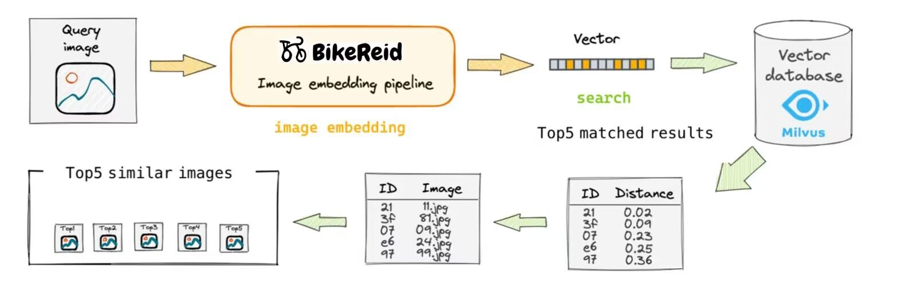
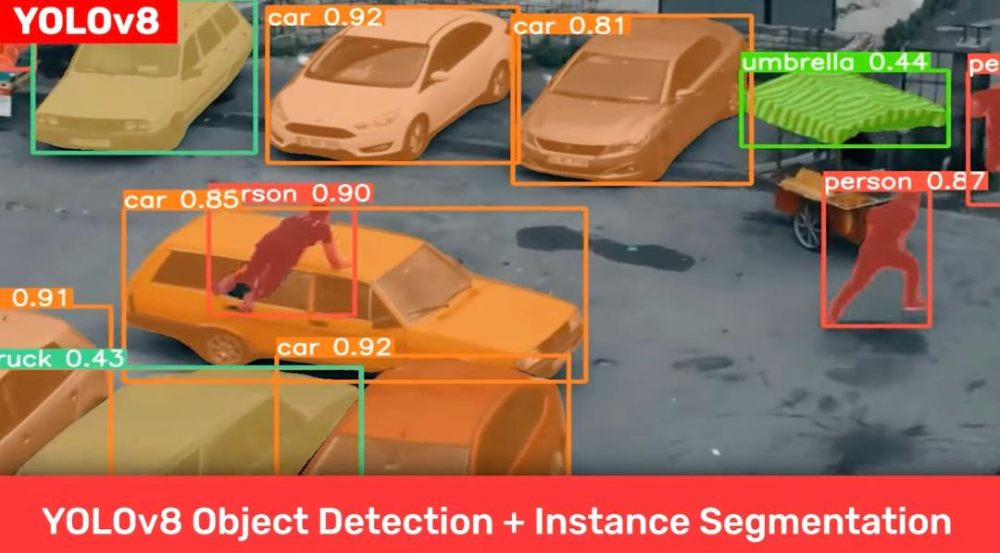
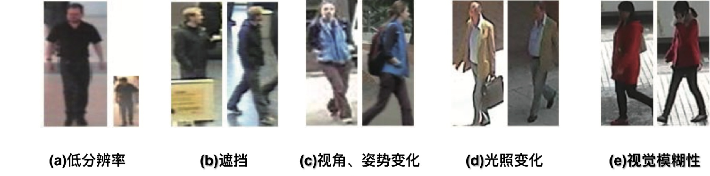
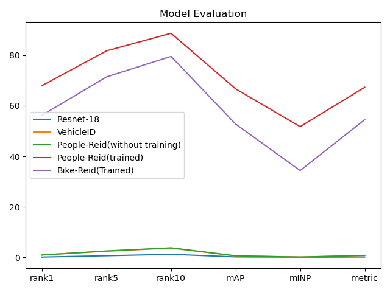
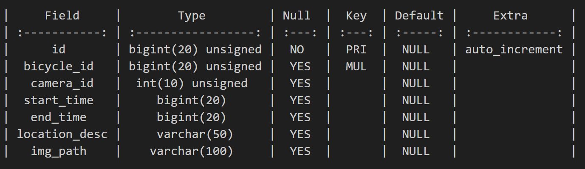

# 软件设计文档

## 总体说明
本项目立足校园安防，聚焦于校园自行车的防盗追踪和自动预警,提供了实时，高效，隐私的BikeReid方案。

我们基于yolox目标检测算法，以监控画面的画面帧作为输入，来实时识别-分割-追踪校园中正在骑行的自行车与自行车上的人。
​		

综合考量了监控分辨度低人像模糊,自行车特征信息不易提取、多机位拍摄带来的画面追踪困难等问题，我们训练了自己的人车重识别的工业级AI模型BikeReid，分离人车特征向量进行表征和度量学习，根据人的穿着、姿态与自行车纹理等特征完成识别分类任务，避免了传统的人脸识别方案带来的隐私问题。每帧的Reid计算生成特征向量平均仅需0.024s,完美完成了实时性的要求。BikeReid在rank10准确率上达到了79.53%,达到工业上部署要求。

此外，我们建立一个Mysql数据库，用来存储各自行车与人的的配对、监控位置与时间戳等基本信息；而对于核心的查询预警功能，利用Milvus引擎针对海量的特征向量进行高速相似度查询。当发现全新的配对时，会将此配对及对应画面加入预警库，从而对自行车盗窃进行预警，并为找回被盗自行车提供便利。

我们的预期使用场景是:当有学生自行车被盗时，数据库会自动发出预警信息，校方仅需查询一次即可获知所有疑似人车不匹配画面帧，选中后再次点击查询，即可显示此辆自行车在监控记录里所有历史人车配对图片,大幅减少查看监控的代价，从而提高寻找被盗自行车的效率。

本项目扩展性良好，对于特征信息更突出的电瓶车、摩托车、乃至汽车等交通工具，只重训REID模型即可实现相同的功能，这里以难度系数较高的自行车识别作为演示。

## 项目框架
项目主要分为人车跨镜头重识别管线与数据库交互管线两部分。

### 人车跨镜头重识别管线
- 输入端为学校内各监控的画面
- 使用YOLOx目标检测模型，分割出画面中的自行车与人，分别框出人与车的位置坐标，并给出锚框置信度。。
- 将得到的人与车图像，分送入Reid模型进行跨摄像头追踪匹配，得到人与自行车的特征向量embedding。

### 数据库交互管线

我们使用一个数据库来存储各自行车与人的特征向量的配对。
同时我们也建立一个预警库来存储可疑的人车配对及其画面样本。当发现全新的记录时，会将此配对及对应画面加入预警库以便对自行车盗窃进行预警，存储的画面将用于为找回被盗自行车提供便利。

- 数据库运行初期需要一定时间收集数据来建库。每年新生入学时也需要暂停预警功能，以便将新生数据入库。
- 考虑到新购买自行车等产生新的人车配对的情况，可以将预警库中较长时间跨度内多次出现的自行车配对加入正常数据库，不进行预警。
- 数据库中许久未访问的项可视为错误识别结果或毕业学生数据，用老化机制来剔除。
- 共享单车的数据可以被过滤。

  

## 模块设计
### 目标检测模块

yolo算法设计快速、准确且易于使用，使其成为各种物体检测与跟踪、实例分割、图像分类和姿态估计任务的绝佳选择 ，具有突出的实时性和高精度等优良特性。 

目标检测模块使用YOLOx目标检测算法，对输入的画面进行目标检测，分割出画面中的自行车与人。

我们选择YOLOX-m模型来完成目标检测功能，该模型参数量为25.33M, Gflops量为73.98，在V100显卡上YOLOX对一帧图像耗时平均为0.024s（图像大小不影响结果，因为其大小会被标准化）

功能：

- 对输入画面进行目标检测
- 分割出自行车与人的目标
- 输出分割结果及位置信息

### 重识别模块
针对监控画质难题，仅仅利用现有的yolo模型无法胜任此任务。故训练了自己的BikeReid模型是重中之重。

训练的AI模型负责将分割出的人车图像分别送入模型进行跨摄像头重识别，得到自行车的特征向量，是本项目核心所在。
下面是BikeReid模型与其余几个模型的效果对比图：

功能：

- 接收分割出的人车图像
- 进行重识别任务(Re-identification)
- 提取自行车的特征向量并输出

### 数据库模块
数据库模块通过MYSQL和Milvus两个数据库耦合共同实现。简要来说，其中MySQL记录人、车、监控编号、时间戳等基本信息，建立关系型数据库；而Milvus向量数据库则专用于自行车特征向量的存储，高速检索，相似度查询功能。

**MySQL部分：**

主功能分为两大块：

1. 新增数据插入：首先进行老化机制判定，剔除过时数据；随后将数据里的自行车特征向量，送入milvus进行相似度检索查询自行车id。若从未出现此id，则插入；若已有记录，则更新该监控编号下的时间戳，保存相关图片信息
2. 用户查询与删除：对于用户提供的需查询自行车图片，返回top-k个相似度的自行车图片以供参考，进一步显示该辆车的所有历史匹配帧，实现被盗自行车的追回。对于用户授权的车主更换，删除原车主在数据库里的记录，以免触发误预警。

##### MySQL存储字段示例：

-  id ：主键
-  bicycle_id ：自动生成的每辆自行车的唯一标识符，创建index
-  camera_id ：监控摄像头编号
-  start_time ：该监控机位下某人车对首次出现帧时间戳
-  end_time ：该监控机位下某人车对最后出现帧时间戳
- location_desc ：地点信息描述
- img_path ：画面帧存放路径，供后续查询

**Milvus部分：**

 Milvus是 基于 FAISS、Annoy、HNSW 的向量搜索数据库，核心是解决稠密向量相似度检索的问题。此外，Milvus 支持数据分区分片、数据持久化、增量数据摄取、标量向量混合查询、time travel 等功能， 针对万亿级向量完成毫秒级搜索，适配在本项目特征向量embedding的索引检索任务 。 

此部分主要功能有

1. 根据索引进行相似度检索:返回记录里余弦相似度top-k个结果
2. 自行车embedding插入：先在milvus里面检索top1,如果与top1的相似度大于阈值，就不插入，否则插入

##### milvus存储字段：

- bicycle_id ：主键，与MySQL表中bicycle_id 字段相同，类似于外键关联两个表
- bicycle_embedding ：某辆自行车通过reid管线生成的2048维特征向量

  

### UI界面模块

