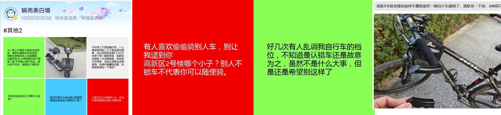

# 需求分析

## 开发背景
随着社会的发展，公共安全成为全社会的一个共同话题，与之相辅相成的视频监控系统也得到了大量的普及。视频监控系统可以直观的再现目标场景，可作为公安侦破案件的强力辅助。在执法部门的工作中，目标的识别和定位是及其关键的一步，然而现有的监控部署下，这个关键步骤几乎是靠着人力完成的。在这个讲究数据和效率的时代，通过人工观察监控录像查找结果显然存在着很大的资源浪费以及效率的低下。另外，由于摄像头的分辨率等硬件缺陷，很难得到清晰的人身图像，因此，已经大力推广的人脸识别技术已不再适用此场景。由于传统人工查询的不便性以及人脸识别的无法应用，我们的自行车防盗重识别的项目也应随之展开。

随着大学校园中自行车的日益普及，自行车盗窃事件也成为了一个日益严重的问题。对于忙于学业的大学生而言，一旦自行车遗失，寻找自行车或报备给保安部门查询监控成为了一项既耗时又无法保证效果的任务。为了更高效地帮助学生及时得知自行车的异常移动，并快速定位到疑似盗窃者和自行车的最后出现位置，我们训练了自己的人车重识别BikeReid模型，创建了一个实时监测自行车是否遭到非法使用的系统。

## 市场分析

### 目标用户

我们的项目针对的目标用户主要是大学校园内的学生和教职员工，他们每天都依赖自行车作为主要的出行工具。由于繁忙的学业和工作，这些用户需要一个简便且高效的方式来保障他们的自行车安全，特别是在面对日益增长的自行车盗窃事件时。他们需要的不仅是一个能够迅速通知自行车异常移动的系统，而且希望能在车辆失窃后，迅速定位到疑似盗窃者和自行车的最后出现位置，从而增加寻回失窃自行车的可能性。

### 竞品分析

在当前市场上，针对自行车盗窃问题，已有一些基于物理锁和GPS跟踪器组合的解决方案，旨在提供自行车的实时位置跟踪。但这些方案在校园内普及和推广上面临一定挑战。首先，它们往往需要用户购买和安装额外的硬件设备，这无疑增加了学生的经济负担。其次，由于校园内环境相对封闭、频繁的自行车停放变动，使得这些方案的效果并不稳定。更重要的是，这些竞品对于骑手的身份验证和识别功能几乎处于空白，这大大限制了其在防盗领域的实用性。相比之下，我们的系统利用了校园现有的监控设备，在不侵犯隐私的条件下，不仅能够实时跟踪自行车的位置，还能自动向服务器提供预警，无需用户额外投资或安装，为校园内的自行车安全提供了一个更为全面和便捷的解决方案，具有显著的竞争优势。

