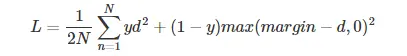

# 调研报告

## 概念解析
- gallery与probe：gallery指注册集或参考集，probe指查询集。通俗一点，gallery是数据库，probe是待识别的图片

### 评价指标
- mAP：mean Average Precision，平均准确率，是一种评价指标，用于评价检索系统的性能。mAP是所有类别AP的平均值。AP是每个类别的准确率，表示的是检测器在各个 Recall 值情况下准确率的平均值，对应的就是 PR 曲线下的面积（AUC， Area Under Curve）。mAP越高，说明检索系统性能越好。
- CMC: Cumulative Matching Characteristic curve，曲线横坐标是n，纵坐标是前n个结果（按模型给出的置信度排序）含正确结果的概率。
- mINP: mean Inverse Negative Penalty，令回收所有G_i个目标所用的猜测机会数为R_i，INP指G_i/R_i，mINP是所有类别INP的平均值。
- IoU（交并比，Intersection over Union）: IoU 计算的是 “预测的边框” 和 “真实的边框” 的交集和并集的比值。

### 损失函数
> 我们将使用Arcface loss
参考：https://zhuanlan.zhihu.com/p/128970124
更基础的参考：https://blog.csdn.net/qq_40321214/article/details/106467270
用于人脸识别的损失函数：基于Euclid Distance的损失函数（Contrastive Loss、Triplet Loss、Center Loss等），基于Angular Margin相关的损失函数（L-Softmax Loss、A-Softmax Loss、CosFace Loss、ArcFace Loss等）

决策边界：ArcFace：Additive Angular Margin，加法角度间隔 SphereFace：Multiplicative Angular Margin，乘法角度间隔 CosFace：Additive Cosine margin，加法余弦间隔

#### softmax loss
> 具有基础性的一个损失函数

其公式为：`Loss = -log(softmax value)`

#### contrastive loss
此损失拉近标签相同的样本的embedding，拉远标签不同的样本的embedding。其公式为：

其中$d=\left \| a_n-b_n  \right \| ^2$,代表两个样本的欧式距离，y为两个样本是否匹配的标签，y=1代表两个样本相似或者匹配，y=0则代表不匹配，margin为设定的阈值。

参考：https://www.jianshu.com/p/21be99fb58ca

#### triplet loss
参考：https://zhuanlan.zhihu.com/p/462539667

对一个三元组，包含一个锚点（anchor）、一个正样本（positive）和一个负样本（negative）。锚点和正样本是同一类的，而负样本则是和锚点不同类的。triplet loss的目标是让锚点和正样本的距离尽可能的小，而锚点和负样本的距离尽可能的大。

其公式为：

其中，d(a,p)表示锚点和正样本的距离，d(a,n)表示锚点和负样本的距离，margin是一个超参数，用来控制锚点和负样本的距离大于锚点和正样本的距离。一般来说，margin的值在0.2到0.5之间。

#### center loss
参考：https://zhuanlan.zhihu.com/p/137764312

为每一类的点与类中心距离的平均值。

一般将其与softmax loss加权求和使用如下：

#### Angular Margin相关损失函数
Angular Margin相关的损失函数就是把softmax loss改成对余弦值求softmax

而一般对类i求softmax值时，会对i项的指数进行更改，以增大类i与其它类的距离，如：

##### A-SoftMax
其公式如下：

##### CosFace Loss
其公式如下：

##### ArcFace Loss
其公式如下：

ArcFace论文解读：https://zhuanlan.zhihu.com/p/374733665

#### Circle Loss
形式上统一了triplet loss和softmax ce loss，并加上了自适应（但不可学习）的参数来调节对Loss中各样本的重视程度（硬例挖掘）。

参考（学习资料）：https://zhuanlan.zhihu.com/p/126701500
参考（评价，含作者亲自答）：https://www.zhihu.com/question/382802283

## Bike-Person Re-Identification: A Benchmark and a Comprehensive Evaluation
提出了第一个人-自行车数据集，并做了第一个进行人-自行车配对再识别的工作。

### 背景
BPReid数据集的特点：
1. 该数据集是第一个自行车-人员再识别数据集。
2. 从真实监控系统采样
3. 摄像头间距离远，涉及场所范围大

要考虑的困难有：光线、遮挡、视角、相似识别对象

相比人员再识别增加的困难有：
1. 人车对在不同角度看变化更大，特别是尺寸和轮廓方面（自行车侧看正看差别巨大）
2. 一辆自行车可以载多个人

### 方法
> 本文仅关心给出一个基本流程，故使用方法较基础，效果较差

流程：分割-特征提取-度量学习(Metric Learning)

分割方法极为粗浅，无参考价值

resize经验表明在其流程下识别精度对人像大小远比自行车图像大小更敏感（它的resize是含拉伸的）

特征提取方法可参考：ELF, LOMO and GOG，上GOG下ELF与上ELF下GOG的效果较好。一般来说，ELF提取局部特征，GOG提取全局特征。LOMO表现差，因为其涉及极大值，容易注意到噪声。

和度量学习(Metric Learning)配合使用时：MLAPG对单车效果较佳，鲁棒性较好，不过较耗时；改进的FDA如LFDA与XQDA也有较好的表现

## DeepSort

### 背景

源自对sort算法的改进：

SORT算法利用**卡尔曼滤波算法**预测**检测框在下一帧的状态**，将**该状态**与**下一帧的检测结果**进行匹配，实现车辆的追踪。那么这样的话，一旦物体受到遮挡或者其他原因没有被检测到，卡尔曼滤波预测的状态信息将无法和检测结果进行匹配，该追踪片段将会提前结束。

遮挡结束后，车辆**检测**可能又将被**继续执行**，那么SORT只能分配给该物体一个**新的ID编号**，代表一个**新的追踪片段**的开始。所以SORT的缺点是：受遮挡等情况影响较大，会有大量的ID切换

那么如何解决SORT算法出现过多的ID切换呢？毕竟是online tracking，不能利用全局的视频帧的检测框数据，想要缓解拥堵造成的ID切换需要利用到**前面已经检测到**的物体的**外观特征**（假设之前被检测的物体的外观特征都被**保存**下来了），那么当物体收到遮挡后到遮挡结束，我们能够利用之前保存的外观特征**分配该物体受遮挡前的ID编号**，降低ID切换。

DeepSORT中采用了**一个简单（运算量不大）**的CNN来提取被检测物体（检测框物体中）的**外观特征**（低维向量表示），在每次（每帧）检测+追踪后，进行一次物体外观特征的提取并保存。

后面每执行一步时，都要执行一次**当前帧被检测物体外观特征**与**之前存储的外观特征**的**相似度计算，**这个相似度将作为一个重要的判别依据（不是唯一的，因为作者说是将**运动特征**与**外观特征**结合作为判别依据，这个运动特征就是SORT中卡尔曼滤波做的事）。

### MOT多目标追踪的基本思路

- 给定视频原始帧。
- 运行目标检测器如Faster R-CNN、YOLOv3、SSD等进行检测，获取目标检测框。
- 将所有目标框中对应的目标抠出来，进行特征提取（包括表观特征或者运动特征）。
- 进行相似度计算，计算前后两帧目标之间的匹配程度（前后属于同一个目标的之间的距离比较小，不同目标的距离比较大）
- 数据关联，为每个对象分配目标的ID。

### 类间调用示意图

